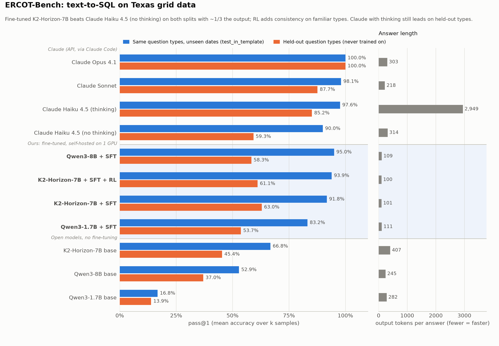

# Grid Intelligence: RL environments and post-trained models for ERCOT data

Base Power hackathon · Track 1 (Open Grid Data) + Track 3 (Most Commercializable)

We built **two verifiable RL environments** on public ERCOT data, graded by code rather than an LLM judge, and used
them to post-train **two small open models** that run self-hosted on a single GPU.

| | Project | What it does | Headline |
|---|---|---|---|
| 1 | [`grid-analyst/`](grid-analyst/) | Answers ERCOT questions by writing SQL over a DuckDB of public ERCOT data; graded against code-computed ground truth | Fine-tuned K2-Horizon-7B beats Claude Haiku 4.5 (thinking off), 92% vs 90%, at ~1–2 s and a third of the tokens |
| 2 | [`load-uncertainty/`](load-uncertainty/) | Predicts the p10/p50/p90 of ERCOT's day-ahead load-forecast error per weather zone, before the 10:00 DAM deadline | Calibrated model cuts ERCOT's forecast miss by ~22% and real-time price exposure by ~33% |



**Why it matters.** ERCOT data is full of conventions (hour ending, 23/25-hour DST days, 15-minute vs hourly prices,
NERC peak blocks) that generic models get wrong, and ERCOT publishes no measure of how uncertain tomorrow's load is.
Battery dispatch and hedging decisions depend on both. Both systems run self-hosted (private, no API bill), and every
answer is checkable: a SQL query or a scored forecast. The environments are reusable training assets: AI labs
reportedly pay around $20K per RL environment to vendors like Mercor and Surge.

## Layout

```
grid-analyst/       Part 1: ERCOT-Bench text-to-SQL environment, SFT + GRPO RL, benchmark, live demo (ercot-bench CLI)
load-uncertainty/   Part 2: load-forecast uncertainty eval, LightGBM baseline, frontier benchmark, SFT + RL
```

Each part is a self-contained `uv` project with its own README, tests, and prime-rl configs. `load-uncertainty` reads
actual load and prices from the DuckDB that `grid-analyst` builds (`grid-analyst/data/ercot.duckdb`; override with
`ERCOT_BENCH_DUCKDB`).

## Quickstart

```bash
# Part 1: build the ERCOT database, generate tasks, test, and try the demo
cd grid-analyst && uv sync && uv run ercot-bench ingest && uv run ercot-bench generate && uv run pytest -q
uv run ercot-bench ask --targets haiku "What was the average day-ahead price at HB_WEST on 2024-08-20, in \$/MWh rounded to 2 decimals?"

# Part 2: run the tests and score any model on the uncertainty eval
cd ../load-uncertainty && uv sync && uv run pytest -q
```

Training runs on the Prime Intellect stack (`prime-rl` + `verifiers`), with a checkout of `prime-rl` beside this repo.
See each part's README for the full pipelines, results, and the memory-safe single-GPU setup.
